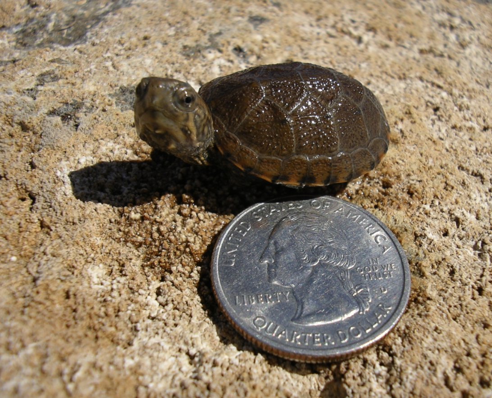
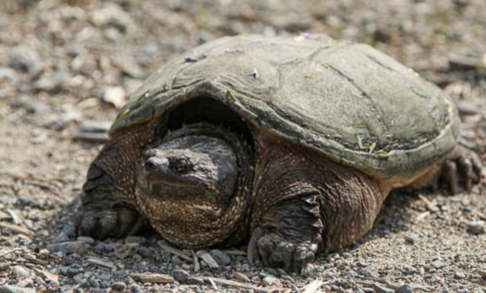

# Turtles

## Facts about turtles

_Source: [National Geographic Kids](https://www.natgeokids.com/uk/discover/animals/sea-life/turtle-facts/)_

1. Turtles belong to one of the oldest reptile groups in the world – beating snakes, crocodiles and alligators!

2. These creatures date back to the time of the dinosaurs, over 200 million years ago – woah!

3. Turtles are easily recognised by their bony, cartilaginous shell. This super-tough casing acts like a shield to protect them from predators – some turtles can even tuck their head up inside their shell for extra protection!

## Famous turtles

- Cecil Turtle from Looney Tunes
- Crush and Squirt from Finding Nemo
- Franklin
- Filbert from Rocko's Modern Life
- Squirtle from Pokemon
- Teenage Mutant Ninja Turtles

> Tip! If you have a turtle tank, make sure to change the water frequently!

## More turtle media

## Markdown things to try
1. Try to make some text on this page **bold** by placing asterisks to either side.
2. Try making some text _italicized_ by placing underscores on either side of the text.
3. Trying creating an ordered and unordered list by using numbers and hyphens. 
4. Try adding another photo.
5. Try creating a hyperlink out like the source link for the turtle facts. 
6. So far, we have header 1s (the title "Turtles"), and header 2s ("Facts about turtles", "Famous turtles", etc.) Try adding a header 3 using `### `.
6. Are there any other [Markdown tasks](https://www.markdownguide.org/basic-syntax/) you want to try?

## Resources
- [Basic markdown syntax](https://www.markdownguide.org/basic-syntax/)
- [HackMD.io shows how your markdown will display realtime](https://hackmd.io/)
- [Quickstart for Github Pages](https://docs.github.com/en/pages/quickstart)